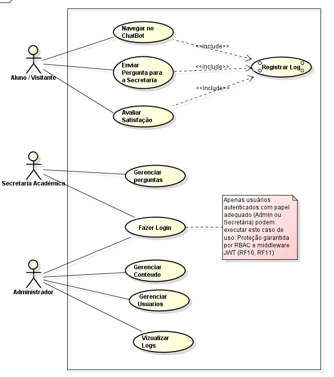
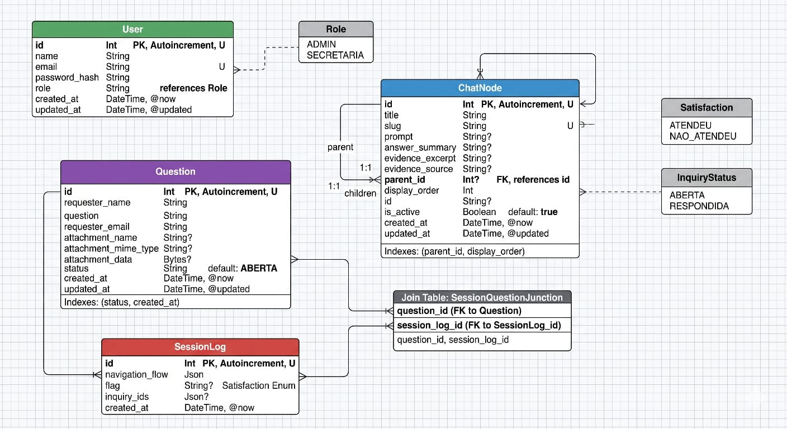

# 📚 docs — Documentação Técnica

> Repositório central da documentação técnica do FatecBot.
> Esta pasta concentra visão arquitetural, padrões de engenharia, contrato de API,
> estratégia de testes, escopo do MVP, guias de apoio e documentação das sprints.

---

## 📑 Índice

- [Estrutura](#estrutura)
- [Comece por aqui](#comece-por-aqui)
- [Matriz de Canonicidade](#matriz-de-canonicidade)
- [Documentos principais](#documentos-principais)
- [Base de conhecimento](#base-de-conhecimento)
- [Sprints](#sprints)
- [Regras de contribuição](#regras-de-contribuicao)
- [Diagramas de caso de uso](#-diagrama-de-casos-de-uso)
- [Modelo Relacional - Banco de dados](#️-modelo-relacional--banco-de-dados)

---

## 📁 Estrutura <a id="estrutura"></a>

```text
docs/
├── README.md                    # Este índice geral
├── first-steps.md               # Ponto de entrada para quem vai contribuir
├── application-overview.md      # Visão geral, perfis, fluxos e modelo de dados
├── project-structure.md         # Organização do monorepo e princípios de estrutura
├── project-standards.md         # Branches, commits, PRs, linting e nomenclatura
├── api-layer.md                 # Contrato REST com envelopes, filtros e paginação
├── assets/
│   └── README.md                # Convenções de assets e diagramas da documentação
├── sprint1/
│   ├── README.md
│   └── tasks.md
├── sprint2/
│   └── README.md
└── sprint3/
    └── README.md
```

---

## 🚦 Comece por aqui <a id="comece-por-aqui"></a>

| Documento                                              | Quando ler                            | Por que ler agora                                           |
| ------------------------------------------------------ | ------------------------------------- | ----------------------------------------------------------- |
| [`first-steps.md`](./first-steps.md)                   | Primeira entrada no projeto           | Centraliza setup, trilhas de leitura e mapa da documentação |
| [`application-overview.md`](./application-overview.md) | Antes de implementar qualquer feature | Resume usuários, fluxos e modelo de dados                   |
| [`project-structure.md`](./project-structure.md)       | Antes de criar arquivos novos         | Mostra onde cada responsabilidade deve viver                |
| [`project-standards.md`](./project-standards.md)       | Antes do primeiro commit              | Define branches, commits, PRs e convenções obrigatórias     |

---

## 🧭 Matriz de Canonicidade <a id="matriz-de-canonicidade"></a>

| Assunto                                         | Documento canônico                               | Como usar os demais documentos                                |
| ----------------------------------------------- | ------------------------------------------------ | ------------------------------------------------------------- |
| Setup e execução local                          | [`first-steps.md`](./first-steps.md)             | READMEs locais devem resumir e apontar para este guia         |
| Contrato HTTP (rotas, payloads e filtros)       | [`api-layer.md`](./api-layer.md)                 | READMEs de módulos devem manter apenas resumo de endpoint     |
| Vocabulário de domínio (papéis, status e flags) | [`api-layer.md`](./api-layer.md)                 | Exemplos didáticos devem explicitar quando forem ilustrativos |
| Padrões de contribuição e nomenclatura          | [`project-standards.md`](./project-standards.md) | Guias de tecnologia não substituem convenções do projeto      |

Em caso de conflito, sempre prevalece o documento canônico da linha correspondente.

---

## 📄 Documentos Principais <a id="documentos-principais"></a>

| Documento                                              | Conteúdo                                                                           | Leitura recomendada para                |
| ------------------------------------------------------ | ---------------------------------------------------------------------------------- | --------------------------------------- |
| [`first-steps.md`](./first-steps.md)                   | Entrada rápida no projeto, setup e trilhas de leitura                              | Qualquer pessoa chegando ao repositório |
| [`application-overview.md`](./application-overview.md) | Perfis de usuário, containers, modelo de dados e fluxos                            | Entender o sistema como produto         |
| [`project-structure.md`](./project-structure.md)       | Organização do monorepo, responsabilidades por pasta e princípios de modularização | Criar ou mover arquivos com segurança   |
| [`project-standards.md`](./project-standards.md)       | Branches, commits, PRs, lint, nomenclatura e regras de env                         | Contribuir sem quebrar o fluxo do time  |
| [`api-layer.md`](./api-layer.md)                       | Endpoints, envelopes, filtros, paginação e códigos de status                       | Integrar frontend e backend             |
| [`../apps/frontend/README.md`](../apps/frontend/README.md) | Setup do frontend, rotas montadas e uso de TanStack Query/Zustand               | Implementar a interface da Sprint 1     |
| [`../apps/backend/README.md`](../apps/backend/README.md)   | Setup do backend, scripts, banco, autenticação e endpoints disponíveis          | Implementar e validar a API da Sprint 1 |

---

## 🧠 Base de Conhecimento <a id="base-de-conhecimento"></a>

A pasta `knowledge-base/` fazia parte da base de apoio do projeto. No estado atual
da árvore de trabalho, as referências operacionais mais úteis para a Sprint 1 estão
concentradas nos READMEs de `apps/frontend` e `apps/backend`.

| Referência                                                          | O que cobre                                                                      |
| ------------------------------------------------------------------- | -------------------------------------------------------------------------------- |
| [`../apps/frontend/README.md`](../apps/frontend/README.md)          | Rotas montadas, autenticação no frontend, chatbot público e setup                |
| [`../apps/backend/README.md`](../apps/backend/README.md)            | Endpoints ativos, scripts, banco, autenticação e decisões do backend             |
| [`application-overview.md`](./application-overview.md)              | Perfis, fluxos, modelo de dados e limites do que está implementado na Sprint 1   |
| [`api-layer.md`](./api-layer.md)                                    | Contrato dos endpoints já disponíveis e dos fluxos previstos                     |

---

## 🏃 Sprints <a id="sprints"></a>

Cada sprint possui uma subpasta própria. Quando existir `tasks.md`, ele é a
referência operacional daquela sprint.

| Sprint | Foco principal                                         | Documentos                                                            |
| ------ | ------------------------------------------------------ | --------------------------------------------------------------------- |
| 1      | Arquitetura base ponta a ponta                         | [`README.md`](./sprint1/README.md) · [`tasks.md`](./sprint1/tasks.md) |
| 2      | Painel Admin, autenticação completa e RBAC             | [`README.md`](./sprint2/README.md) · [`tasks.md`](./sprint2/tasks.md) |
| 3      | Painel da secretária, logs, satisfação e estabilização | [`README.md`](./sprint3/README.md) · [`tasks.md`](./sprint3/tasks.md) |

---

## 📐 Regras de Contribuição <a id="regras-de-contribuicao"></a>

- Documentos de arquitetura geral ficam na raiz de `docs/`
- Arquivos de sprint ficam em `docs/sprint*/`
- Assets, diagramas e imagens da documentação ficam em `docs/assets/`
- Todo link entre documentos deve usar caminho relativo
- Em caso de conflito, os documentos canônicos prevalecem sobre a base de conhecimento e READMEs locais
- Ao criar um documento novo, atualize este índice e o rodapé de navegação relacionado

---

## 📐 Diagrama de Casos de Uso

- [Arquivo editável (.asta)](uml/casos-de-uso.asta)



---

## 🗄️ Modelo Relacional — Banco de Dados



- [PDF do modelo](bd/Modelagem-Banco-Dados.pdf)

---

## 🎨 Design System

A documentação completa dos tokens visuais e componentes reutilizáveis está disponível em [design-system.md](./design-system.md).

- Tokens de cor, tipografia, espaçamento e radius definidos e anotados para facilitar o mapeamento com Tailwind CSS.
- Componentes Figma: Button (primary/secondary/ghost/destructive), Input, Badge, Card, Modal/Dialog, Sidebar, Table.
- Exemplos de mapeamento e orientações de handoff também estão detalhados no arquivo.

> _Próximo documento: [`first-steps.md`](./first-steps.md)_
