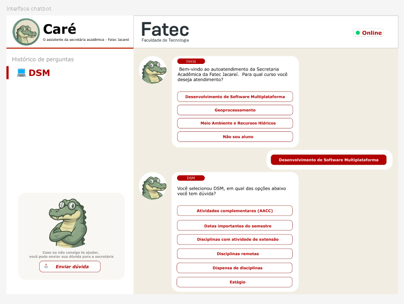
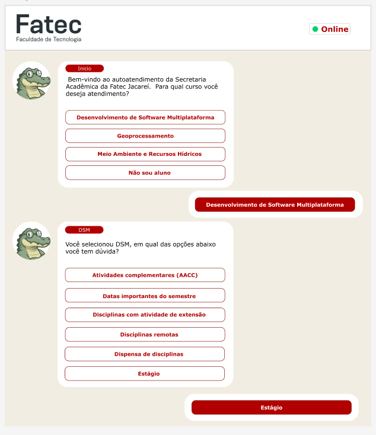
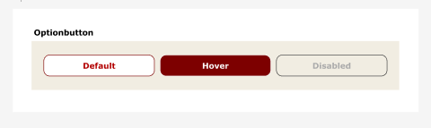
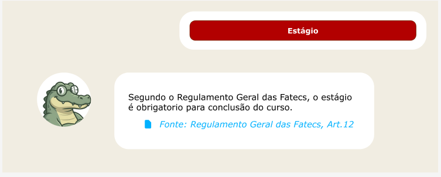
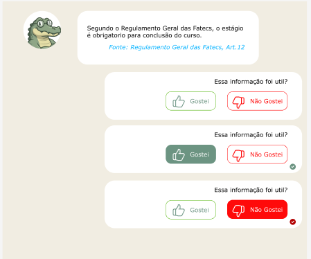
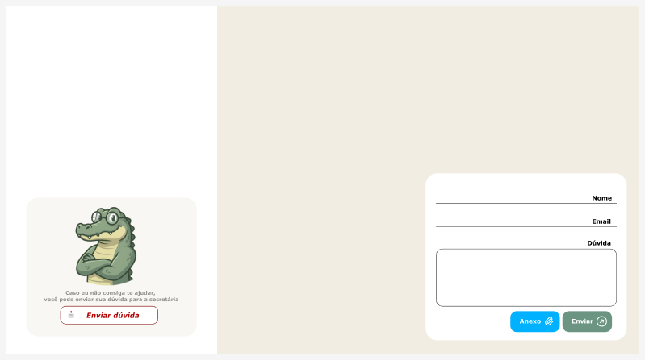
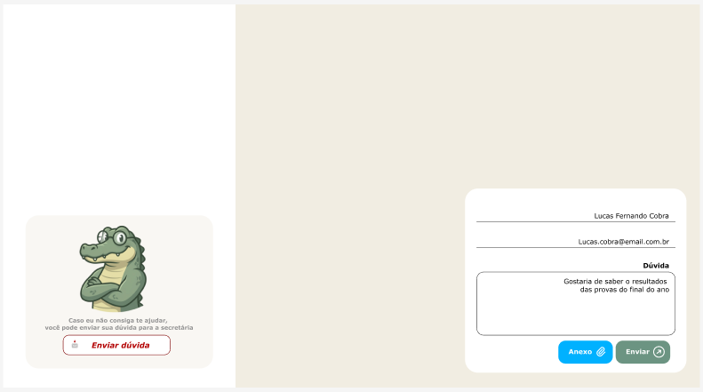
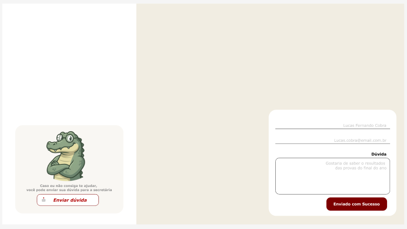

# Design System — Handoff

Este documento reúne os tokens visuais e os componentes reutilizáveis definidos no Figma para o projeto FatecBot, além de orientações para o mapeamento com Tailwind CSS.

## Tokens Visuais

- Paleta de cores primária, secundária e neutra exportada como tokens nomeados (ex: --primary, --background, --destructive)
- Escala tipográfica: heading 1–4, body, caption, code — com família, tamanho e peso
- Escala de espaçamentos baseada em múltiplos de 4px
- Raio de borda (radius) padronizado

Esses tokens estão anotados para facilitar o mapeamento com o arquivo `tailwind.config.ts`.

## Componentes Figma Reutilizáveis

- Button (variantes: primary, secondary, ghost, destructive)
- Input
- Badge
- Card
- Modal/Dialog
- Sidebar
- Table

Todos os componentes estão organizados na página "Design System" do Figma do projeto.

## Handoff para Tailwind

Os tokens definidos no Figma foram mapeados para utilitários do Tailwind CSS, garantindo consistência visual entre design e código. Exemplos:

- `--primary` → `bg-primary` / `text-primary` (Tailwind)
- `--background` → `bg-background`
- `--radius-md` → `rounded-md`
- `--font-heading` → `font-bold`
- `--spacing-md` → `p-4`, `m-4`

Para detalhes completos, consulte o arquivo `tailwind.config.ts` no frontend.

---

## 📸 Galeria Visual do Design System

### Visão Geral

### Paleta de Cores

### Tokens de Espaçamento

### Tokens de Tipografia

### Tokens de Uso de Cores

### Variações de Botão

### PDF de Referência

[Download do PDF de handoff](designer/designer-home.pdf)

---

## 🖼️ Wireframes — Login e Fluxo de Autenticação

As três variantes exigidas pela Task-008 estão disponíveis abaixo:

### 1. Tela de Login (Normal)

### 2. Variante de Erro

_Exibe mensagem de erro para e-mail ou senha inválidos._

### 3. Variante de Loading

_Botão "Entrar" desabilitado e campos bloqueados durante o carregamento._

---

## 🗂️ Wireframes do Chatbot — Task-009

Esta seção apresenta todos os wireframes exigidos pela Task-009, ilustrando os principais estados e componentes da interface do chatbot.

### 1. ChatWindow

_Tela principal do chatbot, exibindo o fluxo de navegação e histórico de perguntas._

### 2. MessageBubble

_As bolhas de mensagem representam as interações do bot (à esquerda, com avatar) e do usuário (à direita, destacada em vermelho)._

### 3. OptionButton

_Exemplo dos três estados do botão de opção: Default, Hover e Disabled._

### 4. EvidenceCard

_Card exibindo um trecho de evidência e a fonte oficial da resposta._

### 5. SatisfactionRating

_Componente de avaliação de satisfação, mostrando os estados: neutro, gostei e não gostei._

### 6. QuestionForm

#### Estado vazio

#### Estado preenchido

#### Estado enviado

_Formulário para envio de dúvida à secretária, com campos para nome, e-mail, dúvida e anexo. Inclui feedback visual de sucesso após o envio._

---

Dúvidas ou sugestões? Consulte o Figma ou entre em contato com o responsável pelo Design System.
